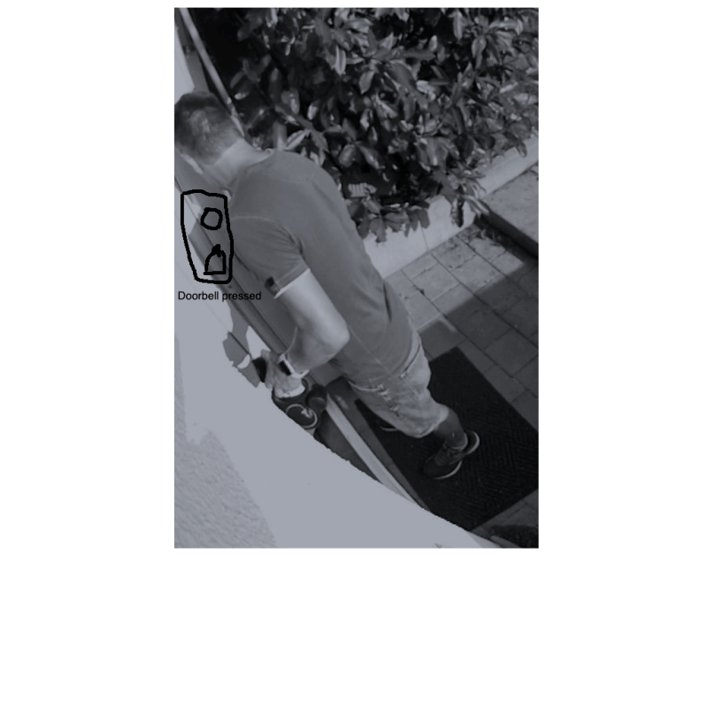
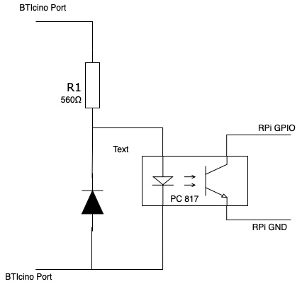
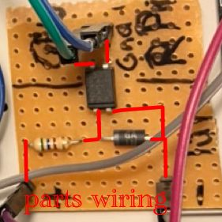
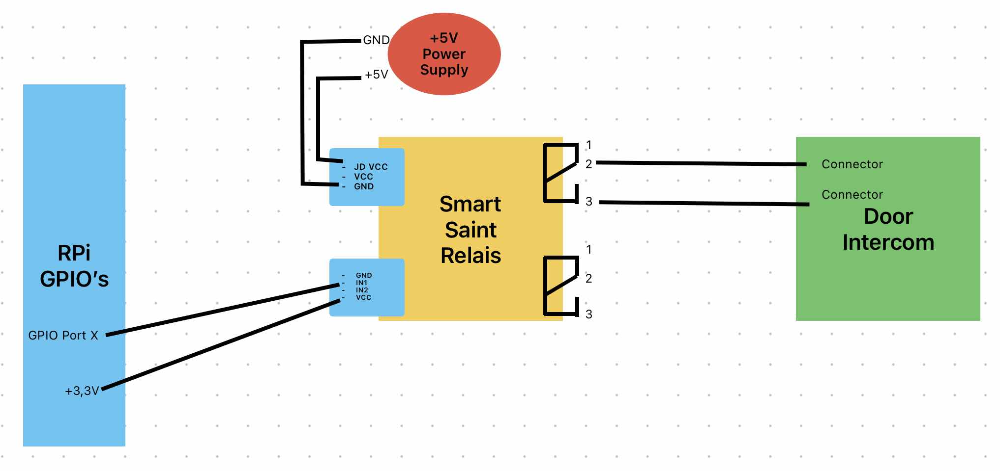
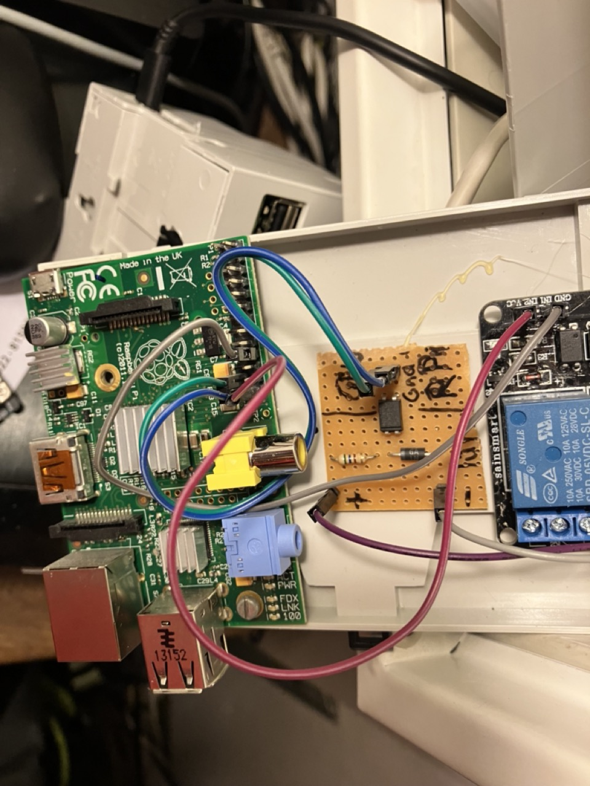
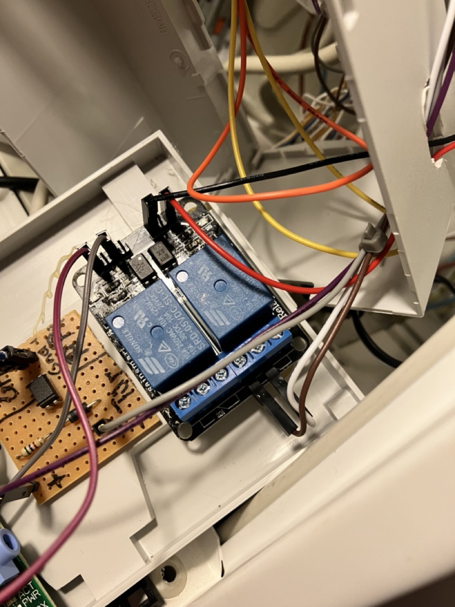
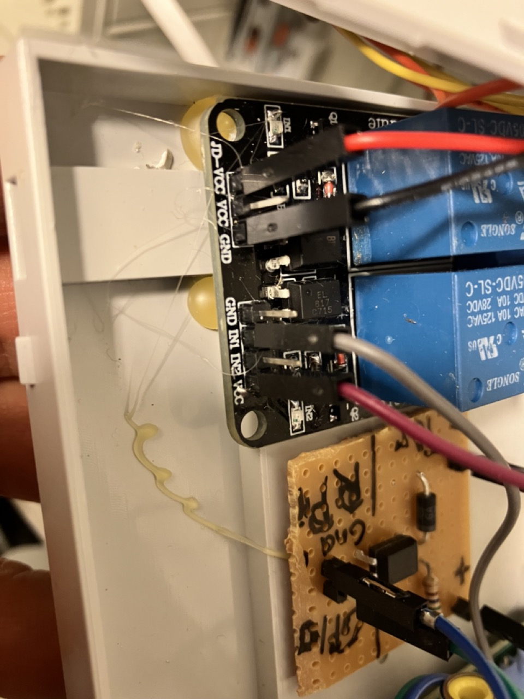

[](https://github.com/OliverDrechsler/front_door_intercom_automation/actions/workflows/codeql-analysis.yml)
[](https://snyk.io/test/github/OliverDrechsler/front_door_intercom_automation)
[](https://sonarcloud.io/dashboard?id=OliverDrechsler_front_door_intercom_automation)
[](https://codecov.io/gh/OliverDrechsler/front_door_intercom_automation)
[](https://github.com/OliverDrechsler/front_door_intercom_automation/actions/workflows/ci.yml)
[](https://github.com/OliverDrechsler/front_door_intercom_automation/actions/workflows/docs_update.yml)


# Front Door Intercom Automation (FDIA)

FDIA extends a conventional, non-smart front door intercom with Raspberry Pi based automation. It can detect doorbell events, trigger a door opener relay, send Telegram notifications, capture camera snapshots, and expose a local web UI plus REST API protected by TOTP.

The project supports both [Blink](https://blinkforhome.com) cameras and the author's Raspberry Pi camera projects [PiCam_API](https://github.com/OliverDrechsler/PiCam_API) and [PiCam_API_2](https://github.com/OliverDrechsler/PiCam_API_2).

Documentation:

- [GitHub Pages documentation](https://oliverdrechsler.github.io/front_door_intercom_automation/README.html)
- [API documentation](https://oliverdrechsler.github.io/front_door_intercom_automation/modules.html)

## Demo



## Table of Contents

- [Overview](#overview)
- [Feature Comparison](#feature-comparison)
- [Requirements](#requirements)
- [Project Structure](#project-structure)
- [Installation](#installation)
- [Helper Tools](#helper-tools)
- [System Service Setup](#system-service-setup)
- [Docker on Raspberry Pi](#docker-on-raspberry-pi)
- [Configuration](#configuration)
- [Cameras](#cameras)
- [Telegram](#telegram)
- [Mobile Setup](#mobile-setup)
- [Web UI and REST API](#web-ui-and-rest-api)
- [iOS Proof of Concept App](#ios-proof-of-concept-app)
- [Hardware Circuits](#hardware-circuits)
- [Help](#help)
- [Changelog](#changelog)
- [Author](#author)
- [License](#license)
- [Security](#security)
- [Contributing](#contributing)
- [Local Development Workflow](#local-development-workflow)

## Overview

The project started from the article [Uberallklingel at heise.de](https://www.heise.de/select/ct/2017/17/1502995489716437) and is designed to add automation to existing intercom systems that are not internet-connected.

FDIA provides:

- Door opening through a relay connected to the Raspberry Pi.
- Doorbell detection through a dedicated hardware circuit.
- Telegram notifications through a private chat or group.
- Door opening protected by TOTP using [PyOTP](https://pyauth.github.io/pyotp/).
- Snapshot capture and delivery on demand or on doorbell events.
- Support for Blink cameras through [BlinkPy](https://github.com/fronzbot/blinkpy).
- Support for Raspberry Pi cameras through [PiCam_API](https://github.com/OliverDrechsler/PiCam_API) or [PiCam_API_2](https://github.com/OliverDrechsler/PiCam_API_2).
- Automatic day and night camera selection using [astral](https://github.com/sffjunkie/astral).
- Optional local Flask-based web UI and REST API for door opening.
- Flexible deployment with optional camera, GPIO, Telegram, and web features depending on your use case.

The hardware for bell detection must be built manually. The relay module for door opening can be purchased and wired to the intercom.

## Feature Comparison

| Feature | FDIA + PiCam_API | FDIA + Blink | Blink only | FDIA without custom hardware |
|---|---|---|---|---|
| Open the door | Yes, with relay hardware | Yes, with relay hardware | No | No |
| Detect doorbell events | Yes, with bell detection hardware | Yes, with bell detection hardware | Yes | No |
| Notifications | Telegram | Telegram | Blink app | Limited, depends on enabled features |
| Multi-user notifications | Yes | Yes | Limited to Blink account usage | Yes |
| Multi-user door opening | Yes | Yes | No | No |
| Local data control | High | Medium | Low | High |
| Local operation without internet | Yes, for door opening | Partially | No | Yes |

## Requirements

### Hardware

- Raspberry Pi Model B+ or newer
- A compatible front door intercom system
- One of the following camera options:
  - A Blink camera
  - A Raspberry Pi camera with `PiCam_API` or `PiCam_API_2`
- Optional bell detection circuit
- Optional relay board for the door opener

### Software

- Python 3.10 or newer
- `pip`
- `git`
- Raspberry Pi OS or Ubuntu on Raspberry Pi

## Project Structure

```text
.
├── bot/                  # Telegram send/receive modules
├── camera/               # Camera integration modules
├── config/               # Configuration helpers, enums, and dataclasses
├── docs/                 # Additional project documentation
├── door/                 # Door opener and bell detection modules
├── test/                 # Unit tests
├── tools/                # CLI helper tools
├── web/                  # Flask web UI and REST API
├── fdia.py               # Main application entry point
├── fdia.service          # Example systemd service unit
├── config_template.yaml  # Configuration template
├── requirements.txt      # Python dependencies
├── Dockerfile            # Container build file
├── CHANGELOG.md          # Release history
├── CONTRIBUTING.md       # Contribution guide
├── SECURITY.md           # Security policy
└── README.md             # Project overview
```

## Installation

For a full Raspberry Pi setup from a fresh OS image, see [docs/How_to_install_fresh_RPi_with_code.md](docs/How_to_install_fresh_RPi_with_code.md).

1. Clone the repository:

```bash
git clone git@github.com:OliverDrechsler/front_door_intercom_automation.git
cd front_door_intercom_automation
```

2. Create a virtual environment:

```bash
python3.11 -m venv .venv
```

3. Install dependencies:

```bash
./.venv/bin/pip install -r requirements.txt
```

Alternatively:

```bash
make install
```

4. Create your local configuration:

```bash
cp config_template.yaml config.yaml
```

5. Update `config.yaml` for your environment.

Useful setup guides:

- [Telegram bot setup](docs/telegram_bot_setup.md)
- [One-time password setup](docs/one_time_password_setup.md)
- [Blink camera setup](docs/blink_camera_setup.md)
- `config_template.yaml` comments for PiCam and web settings

6. Configure GPIO permissions if you want to run FDIA without `sudo`:

```bash
getent group gpio
sudo groupadd gpio
sudo usermod -aG gpio your_username
sudo chown root:gpio /dev/gpiomem
sudo chmod g+rw /dev/gpiomem
```

Optional `udev` rules:

```text
SUBSYSTEM=="gpio", GROUP="gpio", MODE="0660"
SUBSYSTEM=="gpio*", PROGRAM="/bin/sh -c 'chown -R root:gpio /sys/class/gpio && chmod -R 770 /sys/class/gpio; chown -R root:gpio /sys/devices/virtual/gpio && chmod -R 770 /sys/devices/virtual/gpio;'"
```

Reload the rules:

```bash
sudo udevadm control --reload-rules
sudo udevadm trigger
```

If you prefer, you can simply run the application as root:

```bash
sudo python3 fdia.py
```

7. Start the application:

```bash
python3 fdia.py
```

Or with the Poetry helper script defined in `pyproject.toml`:

```bash
poetry run start
```

For troubleshooting, see [Help](#help).

## Helper Tools

### Base32 Password Encode and Decode

Use the helper script in `tools/encrypt_decrypt_password_with_base32.py` to encode or decode the TOTP secret used in `config.yaml`.

Additional documentation:

- [docs/one_time_password_setup.md](docs/one_time_password_setup.md)

### Generate or Verify TOTP from the CLI

Use `tools/totp_helper_cli.py` to generate or validate a TOTP code from your configuration.

Additional documentation:

- [docs/totp_helper_cli.md](docs/totp_helper_cli.md)

## System Service Setup

Update `fdia.service` so that `ExecStart` points to your installation path, for example:

```text
ExecStart=/home/pi/front_door_intercom_automation/fdia.py
```

Then install and enable the service:

```bash
sudo cp fdia.service /etc/systemd/system/
sudo systemctl daemon-reload
sudo systemctl start fdia
sudo systemctl enable fdia.service
```

## Docker on Raspberry Pi

For container-based deployment, including GPIO device mapping, see [docs/How_to_start_FDIA_Docker_container_on_Raspberry_Pi.md](docs/How_to_start_FDIA_Docker_container_on_Raspberry_Pi.md).

## Configuration

### `config.yaml`

`config_template.yaml` is the reference template. Copy it to `config.yaml` and adjust it for your installation:

```bash
cp config_template.yaml config.yaml
```

The file already contains inline comments for every section.

### `blink_config.json`

If Blink support is enabled in `config.yaml`, FDIA will ask for Blink two-factor authentication during the first login. Send the code through Telegram using:

```text
/Blink_auth <6-digit-code>
```

FDIA then stores the authenticated Blink session in `blink_config.json`. Treat this file as sensitive because it contains Blink authentication data.

### TOTP Setup

The TOTP master secret must be stored in Base32 format under:

```yaml
otp:
  password: "BASE32_SECRET"
```

Use `tools/encrypt_decrypt_password_with_base32.py` to generate the encoded value.

For details, see [docs/one_time_password_setup.md](docs/one_time_password_setup.md).

## Cameras

FDIA currently supports two camera families:

- [Blink](https://blinkforhome.com) through [BlinkPy](https://github.com/fronzbot/blinkpy)
- Raspberry Pi cameras through [PiCam_API](https://github.com/OliverDrechsler/PiCam_API) or [PiCam_API_2](https://github.com/OliverDrechsler/PiCam_API_2)

`PiCam_API_2` is based on `picamera2`, while `PiCam_API` is based on the earlier camera stack. Hardware and OS requirements differ between those projects.

### GDPR and Privacy Notice for Germany

If you use camera surveillance in Germany, you may need a visible privacy notice. Requirements vary by country and use case, so verify your local legal obligations yourself.

Relevant references:

- [Datenschutzrechtliche Schranken fuer die private Videoueberwachung](https://www.heise.de/hintergrund/Datenschutzrechtliche-Schranken-fuer-die-private-Videoueberwachung-7238200.html)
- [Datenschutz: Geldstrafen wegen Videokameras in Autos und Wohnhaeusern](https://www.heise.de/news/Datenschutz-Mehr-Beschwerden-wegen-Videoueberwachung-9818938.html)
- [DSK Orientierungshilfe](https://datenschutzkonferenz-online.de/media/oh/20200903_oh_v%C3%BC_dsk.pdf)

Template files included in this repository:

- [HTML template](docs/GDPR_Germany_hint_camera_monitoring_-_DSGVO_Fotografische_Ueberwachung.html)
- [Markdown template](docs/GDPR_Germany_hint_camera_monitoring_-_DSGVO_Fotografische_Ueberwachung.md)

### Blink Cameras

For Blink setup, see [docs/blink_camera_setup.md](docs/blink_camera_setup.md).

### Raspberry Pi Camera Projects

For Pi camera setup, see:

- [PiCam_API](https://github.com/OliverDrechsler/PiCam_API)
- [PiCam_API_2](https://github.com/OliverDrechsler/PiCam_API_2)

## Telegram

### Telegram Setup

Follow [docs/telegram_bot_setup.md](docs/telegram_bot_setup.md) to create the bot and configure the chat IDs.

### Supported Telegram Commands

- `/Foto` takes a snapshot using the default or automatically selected camera.
- `/Blink` takes a snapshot using the Blink camera.
- `/PiCam` takes a snapshot using the PiCam integration.
- `/Blink_auth <6-digit-code>` completes Blink 2FA or MFA authentication.
- `<totp-code>` validates the code, takes a photo, sends it to Telegram, and opens the door.

## Mobile Setup

### Recommended Apps

- [Telegram Messenger](https://apps.apple.com/de/app/telegram-messenger/id686449807)
- [OTP Auth](https://apps.apple.com/de/app/otp-auth/id659877384)
- [Apple Shortcuts](https://support.apple.com/guide/shortcuts/welcome/ios)

### OTP App Setup

Configure the same OTP secret and settings in your mobile OTP app that you use in `config.yaml`.

Guide:

- [docs/How_to_setup_OTP_App_on_mobile_phone.md](docs/How_to_setup_OTP_App_on_mobile_phone.md)

### Typical Mobile Workflow

Generate a TOTP code in your OTP app and send it to the Telegram chat watched by the bot. If the code is valid, FDIA opens the door.

If you use the web API from a mobile device, keep it inside your local network or access it through a VPN. Do not expose the Flask UI or REST API directly to the public internet.

### Apple Shortcuts Automation

Guide:

- [docs/How_to_setup_Shortcut_to_open_door.md](docs/How_to_setup_Shortcut_to_open_door.md)

This setup works with the Flask REST API. For remote access, a VPN is strongly recommended.

## Web UI and REST API

FDIA can expose a local Flask web application and a REST API when enabled in `config.yaml`:

```yaml
web:
  enabled: True
  flask_web_host: "0.0.0.0"
  flask_web_port: 5001
  flask_secret_key: "my_super_flask_secret_key"
  browser_session_cookie_lifetime: 30
  session_cookie_secure: False
  trusted_reverse_proxies:
    - "127.0.0.1"
  flask_users:
    - WebUser1: "password"
    - WebUser2: "password"
```

Notes:

- Multiple users can be configured for the web UI and REST API.
- If you need HTTPS, place FDIA behind a reverse proxy such as NGINX.
- The web UI is a local convenience feature, not a hardened internet-facing application.
- Remote access should be done through a VPN, not by directly exposing the service.

### REST API Example

Endpoint:

```text
POST http://<host>:<port>/open
```

Authentication:

- HTTP Basic Authentication with Base64-encoded `username:password`

Request body:

```json
{
  "totp": "<YOUR_TOTP_CODE>"
}
```

Example:

```bash
curl -X POST http://127.0.0.1:<FLASK_WEB_PORT>/open \
  -H "Content-Type: application/json" \
  -H "Authorization: Basic <BASE64_ENCODED_CREDENTIALS>" \
  -d '{"totp":"<YOUR_TOTP_CODE>"}'
```

## iOS Proof of Concept App

An iOS proof-of-concept client is available here:

- [FDIA_IOS_App](https://github.com/OliverDrechsler/FDIA_IOS_App)

## Hardware Circuits

The bell detection board and door opener relay can be adapted to many existing intercom systems, not only BTicino.

### Doorbell Detection

Enable the feature in `config.yaml`:

```yaml
GPIO:
  enable_door_bell_port: True
  door_bell_port: 1
```

Required electronic parts:

- Stripboard, epoxy, 100 x 100 mm, 2.54 mm grid
- Optocoupler `PC817`
- Resistor sized for the bell voltage:
  - `330 Ohm` for 8 V
  - `560 Ohm` for 12 V
  - `1.2 kOhm` for 24 V
- Raspberry Pi DIN-rail power supply, for example `Mean Well MDR-20-15`

Circuit diagram:



Example build:



### Door Opener Relay

Enable the feature in `config.yaml`:

```yaml
GPIO:
  enable_door_opener_port: True
  door_opener_port: 2
```

The project recommends a SainSmart 2-channel 5 V relay module.

Wiring notes:

- The Raspberry Pi GPIO pin controls `IN1`.
- A separate 5 V supply can power `JD-VCC` and `JD-GND`.
- The relay output is connected to the intercom's door opener circuit.

Wiring image:



Additional documentation:

- [docs/SmartSaint_Relais_Jumper.md](docs/SmartSaint_Relais_Jumper.md)

Build photos:





### BTicino Wiring Plans

See [docs/BTIcino_Intercom-wiring.md](docs/BTIcino_Intercom-wiring.md).

## Help

### Debugging

Set the log level with the `LOG_LEVEL` environment variable:

```bash
export LOG_LEVEL=DEBUG
python3 fdia.py
```

Supported values:

- `CRITICAL`
- `ERROR`
- `WARN`
- `INFO`
- `DEBUG`

If you prefer a code-level default, adjust this line in `fdia.py`:

```python
default_log_level = os.getenv("LOG_LEVEL", "INFO").upper()
```

With debug logging enabled, you can inspect the main thread, Telegram threads, camera thread, web thread, doorbell thread, door opener thread, and library debug output from Blink and Telegram.

FDIA uses queues for communication between threads. The related shared dataclasses are defined in `config/data_class.py`.

If you cannot resolve an issue from the logs, open a GitHub issue with the relevant error details.

### Useful References

- [BlinkPy](https://github.com/fronzbot/blinkpy)
- [PyTelegramBotAPI](https://github.com/eternnoir/pyTelegramBotAPI)
- [Flask](https://flask.palletsprojects.com/)
- [PyOTP](https://pyauth.github.io/pyotp/)
- [Uberallklingel article](https://www.heise.de/select/ct/2017/17/1502995489716437)

### Run Unit Tests

```bash
./.venv/bin/pytest
```

With coverage:

```bash
./.venv/bin/pytest --cov=./ --cov-report=html
```

Or via `make`:

```bash
make test
make test-cov
```

### GitHub Actions

See `.github/workflows` for:

- CI pipeline
- CodeQL analysis
- Documentation publishing
- Dependency and security automation

## Changelog

See [CHANGELOG.md](CHANGELOG.md).

## Author

Oliver Drechsler, Java and Python developer.

- [GitHub](https://github.com/OliverDrechsler)
- [LinkedIn](https://www.linkedin.com/in/oliver-drechsler)
- [Xing](https://www.xing.com/profile/Oliver_Drechsler5)
- [Stack Overflow](https://stackoverflow.com/users/13054340/oliver-d)
- [Twitter](https://twitter.com/lolly_olmi)

## License

This project is licensed under the MIT License. See [LICENSE](LICENSE).

Third-party dependency licenses are listed in [requirements_licenses.txt](requirements_licenses.txt).

To regenerate that file:

```bash
pip3 install licensecheck
licensecheck -u requirements > requirements_licenses.txt
```

If `licensecheck` fails, temporarily remove inline comments from `requirements.txt` and run it again.

## Security

See [SECURITY.md](SECURITY.md).

## Contributing

See [CONTRIBUTING.md](CONTRIBUTING.md) and the pull request template in [docs/pull_request_template.md](docs/pull_request_template.md).

## Local Development Workflow

1. Clone the repository and enter the directory:

```bash
git clone <your-repository-url>
cd front_door_intercom_automation_2
```

2. Create and activate a virtual environment:

```bash
python3 -m venv .venv
source .venv/bin/activate
python -m pip install --upgrade pip
```

3. Create a development branch from `master`:

```bash
git checkout master
git pull origin master
git checkout -b my-local-dev-branch
```

4. Install dependencies:

```bash
python -m pip install -r requirements.txt
```

5. Make changes and run tests:

```bash
python -m pytest
```

6. Commit your work:

```bash
git status
git add .
git commit -m "Describe your change"
```

7. Return to `master` when finished:

```bash
git checkout master
```

8. If you changed `requirements.txt`, restore it and reinstall the original dependencies:

```bash
git restore requirements.txt
python -m pip install --upgrade --force-reinstall -r requirements.txt
```

9. Optionally delete the local branch after it is no longer needed:

```bash
git branch -d my-local-dev-branch
```
