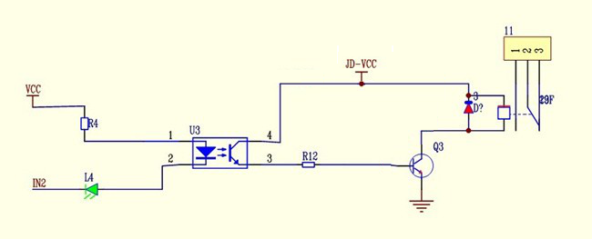
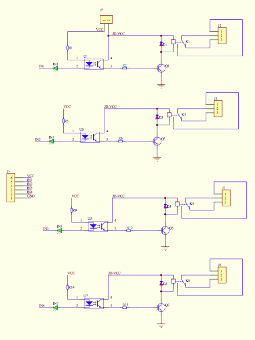
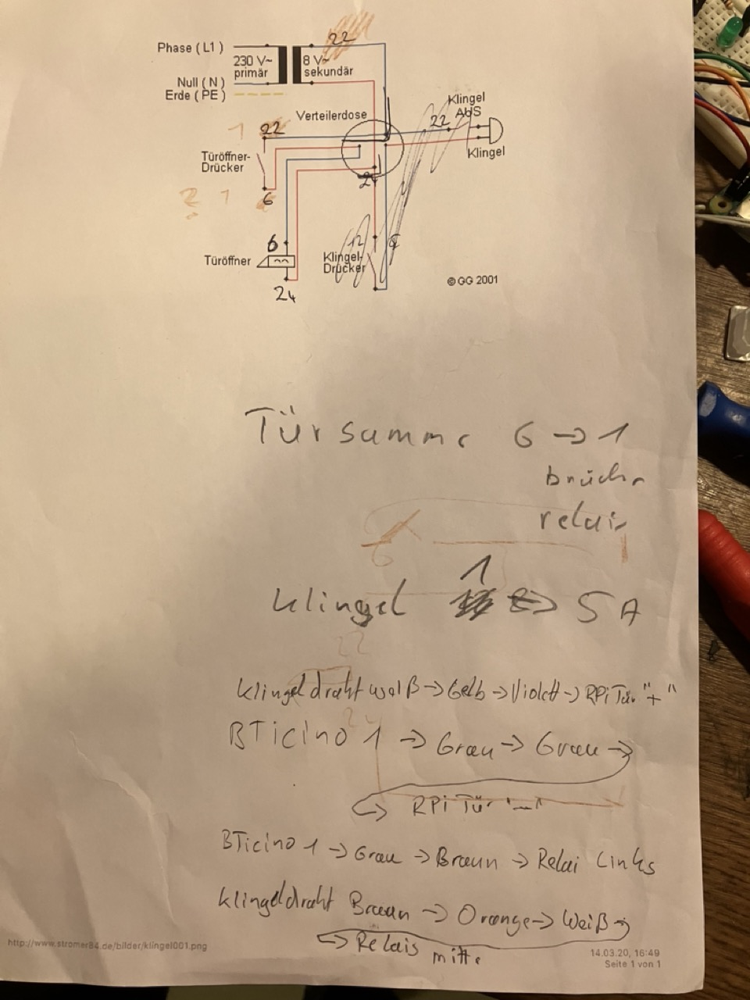
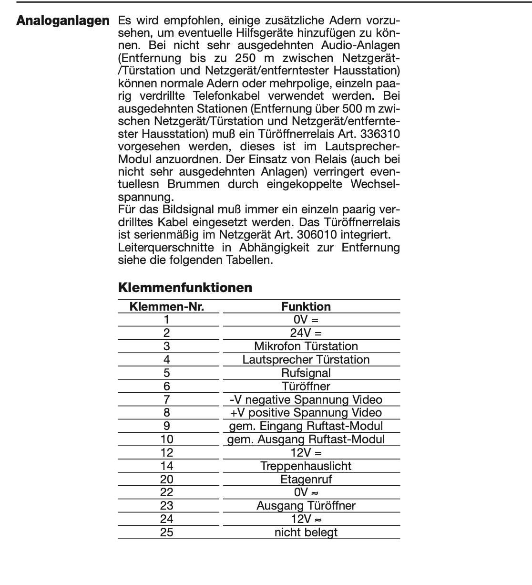

[](https://github.com/OliverDrechsler/front_door_intercom_automation/actions/workflows/ci.yml)
[](https://github.com/OliverDrechsler/front_door_intercom_automation/actions/workflows/codeql-analysis.yml)
[](https://snyk.io/test/github/OliverDrechsler/front_door_intercom_automation)
[](https://sonarcloud.io/dashboard?id=OliverDrechsler_front_door_intercom_automation)
[](https://codecov.io/gh/OliverDrechsler/front_door_intercom_automation)


  

[](https://github.com/OliverDrechsler/front_door_intercom_automation/actions/workflows/docs_update.yml)
  
  
  
# Front-door intercom automation

## Short description

Raspberry Pi intercom front door automation for recognising doorbells and creating photos.  
Notification via your own privat Telegram chat channel.  
Also opening the front door via the private Telegram chat channel.  
Furthermore, a separate website & REST API is offered to open the front door.  
**It is not recommended to make this website accessible on the Internet!**    
Please use a VPN tunnel to reach the website or REST API.  
It supports [Blink](https://blinkforhome.com) camera's and my [PiCam_API](https://github.com/OliverDrechsler/PiCam_API) project.  
Door opening authorization is handled by timebased one time passwords.  
The following wiring of the circuit is based on a BTIcino intercom system, but can also be connected to other systems.  


**[📚 View on Github Pages](https://oliverdrechsler.github.io/front_door_intercom_automation/README.html)**  

***[📚 API Docu on Github Pages](https://oliverdrechsler.github.io/front_door_intercom_automation/modules.html)***  


- [Front-door intercom automation](#front-door-intercom-automation)
  - [Short description](#short-description)
  - [Long description](#long-description)
  - [Features advantage comparision FDIA, Blink, Ring and PiCamAPI](#features-advantage-comparision-fdia-blink-ring-and-picamapi)
  - [Demo](#demo)
  - [Outlook/Ideas](#outlookideas)
    - [Plan](#plan)
    - [Ideas](#ideas)
  - [Get started](#get-started)
    - [Requirements](#requirements)
    - [Code tree structure](#code-tree-structure)
    - [Installation](#installation)
    - [Helper tools](#helper-tools)
      - [Encrypt and decrypt a password with base32 for totp](#encrypt-and-decrypt-a-password-with-base32-for-totp)
      - [get a OTP password or verify a OTP via cli](#get-a-otp-password-or-verify-a-otp-via-cli)
    - [System service setup](#system-service-setup)
    - [Configuration - config files](#configuration---config-files)
    - [config.yaml - config\_template.yaml](#configyaml---config_templateyaml)
    - [blink\_config.json](#blink_configjson)
    - [Setup OTP](#setup-otp)
  - [Cameras](#cameras)
    - [Blink Cameras](#blink-cameras)
    - [Raspberry Pi Camera Project PiCam\_API](#raspberry-pi-camera-project-picam_api)
  - [Telegram](#telegram)
    - [Telegram setup](#telegram-setup)
    - [Telegram receiving message commands and interactions](#telegram-receiving-message-commands-and-interactions)
  - [Mobile Setup](#mobile-setup)
    - [Mobile Apps](#mobile-apps)
    - [Setup recommended OTP in your mobile phone](#setup-recommended-otp-in-your-mobile-phone)
    - [Mobile usage](#mobile-usage)
    - [Mobile IOS Door Open App](#mobile-ios-door-open-app)
    - [How to use Apple IOS Shortcuts App to automate door opening](#how-to-use-apple-ios-shortcuts-app-to-automate-door-opening)
  - [Web UI \& REST-API usage](#web-ui--rest-api-usage)
  - [Hardware Ciruit](#hardware-ciruit)
    - [required HW parts](#required-hw-parts)
      - [Door bell detection board](#door-bell-detection-board)
      - [Door opener board with relais:](#door-opener-board-with-relais)
    - [BTICino CT20/51 Intercom plans](#bticino-ct2051-intercom-plans)
    - [Dor bell ring plan](#dor-bell-ring-plan)
    - [BTICino CT20/51 wiring pictures](#bticino-ct2051-wiring-pictures)
    - [Door open summer SaintSmart relay wiring pictures:](#door-open-summer-saintsmart-relay-wiring-pictures)
  - [Help](#help)
    - [Debugging](#debugging)
    - [Hints](#hints)
    - [How to run unit-tests](#how-to-run-unit-tests)
    - [GiHub actions pipelines](#gihub-actions-pipelines)
  - [ChangeLog](#changelog)
  - [Previous Python Version releases](#previous-python-version-releases)
  - [Author info](#author-info)
  - [License](#license)
  - [Contribution](#contribution)


## Long description

Starting point was an article [Überallkingel at heise.de](https://www.heise.de/select/ct/2017/17/1502995489716437).  
This front door intercom system extends any standard front door intercom system,  
which are not connected to the Internet or ready for it.
The project offers the following functionality:
- Front door bell detection. 
- Notification via private Telegram channel [PyTelegramBotAPI library](https://github.com/eternnoir/pyTelegramBotAPI)
- Photo creation and telegram sending on doorbell ringing.  
- Front door opening via time-based one-time password [PyOTP library](https://pyauth.github.io/pyotp/)
- Use of [Blink](https://blinkforhome.com) cameras with [BlinkPy library](https://github.com/fronzbot/blinkpy)
- Use of my Raspberry PI camera Project [PiCam_API](https://github.com/OliverDrechsler/PiCam_API) Project.
- Day / night detection to select the appropriate camera if several are used simultaneously via [astral library](https://github.com/sffjunkie/astral)
- Blink camera multi factory authentication setup via telegram chat message if Blink requires this.
- Blink camera or PiCamera photo creation and sending on Telegram message request.
- Automatic camera selection between Blink or PiCam_APi possible.
- Fallback camera selection if one fails.
- Internal [Flask](https://flask.palletsprojects.com/en/3.0.x/) website to open the front door with the browser using a time-based one-time password.
- Internal [Flask](https://flask.palletsprojects.com/en/3.0.x/) REST-API to open the front door (via time-based one-time password) for integration into other projects / solutions / automations.

## Features advantage comparision FDIA, Blink, Ring and PiCamAPI

| Project with Product / <br/> Features,Capabilities | FDIA with PiCamAPI Camera                                                                                            | FDIA with Blink Camera                                                                                | FDIA with upcoming Ring Camera support - not there (idea to integrate)                                | Blink only (no FDIA)               | Ring only ( FDIA)                  | FDIA with no build HW module                 |
|----------------------------------------------------|----------------------------------------------------------------------------------------------------------------------|-------------------------------------------------------------------------------------------------------|-------------------------------------------------------------------------------------------------------|------------------------------------|------------------------------------|----------------------------------------------|
| Open Door                                          | ✅ with build HW module [Door opener board with relais:](#door-opener-board-with-relais)                              | ✅ with build HW module [Door opener board with relais:](#door-opener-board-with-relais)               | ✅ with build HW module [Door opener board with relais:](#door-opener-board-with-relais)               | ❌                                  | ❌                                  | ❌                                            |
| detect door bell ring                              | ✅ with build Hw module [Door bell detection board](#door-bell-detection-board)                                       | ✅ with build Hw module [Door bell detection board](#door-bell-detection-board)                        | ✅ with build Hw module [Door bell detection board](#door-bell-detection-board)                        | ✅                                  | ✅                                  | ❌                                            |
| Notification (channel)                             | ✅ via Telegram group                                                                                                 | ✅ via Telegram group                                                                                  | ✅ via Telegram group                                                                                  | ✅Blink App                         | ✅Ring App                          | ✅❌ Telegram but no HW module -> no detection |
| Multi user notification                            | ✅                                                                                                                    | ✅                                                                                                     | ✅                                                                                                     | ❌ dependend on Account             | ❌                                  | ✅                                            |
| Multi user door opening                            | ✅                                                                                                                    | ✅                                                                                                     | ✅                                                                                                     | ❌                                  | ❌                                  | ❌                                            |
| GDPR data storage                                  | ✅ no Internet facing data/nor Camaera exposure; Telegram chat group archival dependend on personal deletion interval | ✅Telegram chat group archival dependend on personal deletion interval - Cemera internet/clodu exposed | ✅Telegram chat group archival dependend on personal deletion interval - Cemera internet/clodu exposed | ❌ Camaera Internet / Cloud exposed | ❌ Camaera Internet / Cloud exposed | ✅ no data Exposure                           
| Local usage without Internet (door opening)        | ✅                                                                                                                    | ✅opening - ❌ no camera snapshot                                                                      | ✅opening - ❌ no camera snapshot                                                                       | ❌                                  | ❌                                  | ✅                                            |

## Demo
-> short Telegram usage video will follow.   
-> short video WebUi usage video will follow.  

## Outlook/Ideas - Improvements plan

### Plan 
- [ ] fix codecov
- [ ] extend docu for RPi.GPIO access with normal user
- [ ] create docu for german users with camera snapshot GDPR hint at the front door
- [ ] extend docu with pcb wiring layout  
- [ ] create docu IOS ShortCut App with aotmatic door opening  and GeoFencing  
- [ ] create demo videos
- [ ] create docu OTP App
- [ ] Same solution is in development as JAVA Spring Boot app too.  
- [ ] Also a IOS Swift App, which makes telegram app and OTP obsolete for opening the door.  
     It's actually a POC will be published soon. 
- [ ] Next it's planned to extend the Web-UI with more features (like show snapshots and other things)

### Ideas
- [ ] add docker container build, image at GHCR and support via docker-compose.yaml
- [ ] Blink door bell notification
- [ ] Integrate Ring Cameras(video Doorbell too) (depends on lack of hardware - donation welcome - or temporary provision for development)
- [ ] Further it's planed to integrate door opening in Amazon Alexa as ProofOfConcept.  
- [ ] Integration offering in [HomeAssistant](https://www.home-assistant.io/)
- [ ] Support Google / Microsoft Authentication App with their format

## Get started

### Requirements
Hardware:
- Raspberry PI B+ or above
- Blink Camera oder Pi Zero with PiCam_API Project installed
- Front door intercom like BTIcino
  
Software:
- Python 3.10 or above
- pip
- git
- Rasbian oder Ubuntu on Raspberry Pi

### Code tree structure

```
.
├── bot                   # Telegram modul classes for receiveing and sending
├── camera                # Camera module 
├── config                # Config module, enum and data classes
├── docs                  # Further documentation
│   ├── _source           # Documentation source dir for build docu page
│   │   └── _static        # static docu images
│   ├── telegram_bot_setup.md     # Telegram bot setup how to
│   └── pull_request_template.md  # Pull request template
├── door                  # Door module classes for opening or bell detection  
├── test                  # Unit tests
├── tools                 # CLI Helper tools
│   ├── encrypt_decrypt_password_with_base32.py   # Encrypt or decrypt with base32 input password 
│   └── totp_helper_cli.py                        # create or verify a TOTP from config file 
└── web                   # Flask Webpage & REST-API modul class
    ├── static            # Static web page icon files for favicons
    └── templates         # Served and rendered web pages
fdia.py                   # Main program code
fdia.service              # Linux systemd service template file
requirements.txt          # Depend lib to install via pip
config_template.yaml      # Template config file
Makefile                  # make for build html docs - github pages 
README.md                 # This readme
LICENSE                   # This project license
CHANGELOG.md              # Project release changelog file
requirements_licenses.txt # depend library licenses
pull_request_template.md  #  Pull request how to

```

### Installation

**For fresh install on RaspberryPi with code follow [How_to_install_fresh_RPi_with_code.md](docs/How_to_install_fresh_RPi_with_code.md)** 

1. Clone repo to your RPi.
```git clone git@github.com:OliverDrechsler/front_door_intercom_automation.git```

2. go into project repo `cd front_door_intercom_automation`

3. now run pip3 to install python requirments
  ```pip3 install requirements.txt```

4. copy config_template.yaml to config.yaml file
   `cp config_template.yaml config.yaml`

5. edit `config.yaml` file with your favorite editor

   - for creation of telegram bot and privat chat channel follow [telegram_bot_setup](docs/telegram_bot_setup.md)
   - for creation of base32 encrypted timebased one time password master password follow [one_time_password_setup](docs/one_time_password_setup.md)
   - for blink configuration follow [blink_camera setup](docs/blink_camera_setup.md)
   - for picam configuration follow config_template.yaml doc remarks or PiCam_API Projects
   - for flask web config follow description in `config_template.yaml`

6. run app
   `python3 fdia.py`
   and check log output

   for troubleshooting see [Help](#help)

7. setup app to run as daemon / service in linux follow [System service setup](#system-service-setup)

### Helper tools

#### Encrypt and decrypt a password with base32 for totp
see further docu [docs/one_time_password_setup.md](docs/one_time_password_setup.md)

#### get a OTP password or verify a OTP via cli
see further docu [docs/totp_helper_cli.md](docs/totp_helper_cli.md)


### System service setup
Edit file `fdia.service` and adjust to your path ( `ExecStart=/home/pi/front_door_intercom_automation/fdia.py` ).  
To run fdia as a service on startup with root permissions  
copy `fdia.service`to `/etc/systemd/system/`to your RPi systemd deamon folder.  
Run `systemctl daemon-reload` and `systemctl start fdia`to start it as a service.  


### Configuration - config files

### config.yaml - config_template.yaml
config_template.yaml is a template config file and must be adjusted to your needs.  
Copy config_template.yaml to config.yaml into project root folder.  
`cp config_template.yaml config.yaml`  
  
In this yaml file you'll find after `#` comments / hints for which the line is what to configure.  
  
### blink_config.json

If you have configured in the `config.yaml` your blink camera  
( followed by this docu [blink_camera setup](docs/blink_camera_setup.md) )  
after starting `fdia.py` application you can send your received blink 2 factor token via telegram channel
to the application.  
It starts to authenticate via 2FA(FactorAuthentication) / MFA (multi factor authentication) and saves afterwards the 
blink config to the file `blink_config.json`. From now on it is getting used and normally no further
2FA / MFA authentication is not anymore required.  
Handle this file careful since there is your blink secret stored.

### Setup OTP

To store a master password for *totp* *time pased one time password* it must be encoded with base32 as a hash.
You can run the the cli script `encrypt_decrypt_password_with_base32.py` in `tools` directory.
Than you get a base32 hashed password.  
Please store this password in the `config.yaml` under section `otp:` `password:`

For further docu refer to [docs/one_time_password_setup.md](docs/one_time_password_setup.md)

## Cameras

This project actually supports two type of cameras.
- [Blink](https://blinkforhome.com) cameras with [BlinkPy library](https://github.com/fronzbot/blinkpy)  
  This means all Blink cameras are supported.  
- My Raspberry PI camera Project [PiCam_API](https://github.com/OliverDrechsler/PiCam_API) Project.  
  It is a self coded software project which just requires a Raspberry Pi and a wired Camera.
  It is your choice when you want to be more GDPR compliant and don't want to expose your camera to the internet. Also you can use this project from your home wireless network only via web ui and must not use telegram.

### Blink Cameras

For configuration of the blink camera please procceed with further [docu/blink_camera_setup.md](docs/blink_camera_setup.md).  


### Raspberry Pi Camera Project PiCam_API

For configuration of the PiCam_API please procceed with the [PiCam_API Project](https://github.com/OliverDrechsler/PiCam_API) docu.  


## Telegram

### Telegram setup
please follow exra documentation here [telegram_bot_setup](docs/telegram_bot_setup.md)

### Telegram receiving message commands and interactions

Received Telegram chat channel message command to action

- `/Foto` = request to take a foto auto choice for PiCam or Blink config and send it in the telegram chat channel
- `/Blink` = request to take a Blink foto and send it in the telegram chat channel
- `/PiCam` = request to take a PiCam_API foto and send it in the telegram chat channel
- `/Blink_auth <here your 6 digit security code>` = request to do a blink 2FA / MFA authentication and store blink config  
- `<time based one time password code>` = validate totp, take a foto send it and open door.


## Mobile Setup

Install on your Mobile following Apps and set it up.

### Mobile Apps
* [Telegram Messagenger for free in AppStore](https://apps.apple.com/de/app/telegram-messenger/id686449807) 
* [OTP Auth App for free in AppStore](https://apps.apple.com/de/app/otp-auth/id659877384)
* [Apple IOS Shortcuts for REST API automation](https://support.apple.com/de-de/guide/shortcuts/welcome/ios)


### Setup recommended OTP in your mobile phone

Provide configure same OTP config in OTP Auth App like in `config.yaml` defined.  


### Mobile usage

Use OTP App to get a totp code and copy to clipboard.  
Paste clipboard code into telegram chat channel where front-door intercom automation bot ist listening.
When bot receives valid code - door will be opened.

Apple IOS Shotcuts App can be used to to send direct otp code passwords to REST-API.
As long as you are in the local network as the fron door intercom automation is you can send it direct.
If you're away for your home wireless network you can use a VPN tunnel to connect to your ISP router  
and than send the otp door open code to the REST-API.  
Do not expose the Flask Web-UI or REST-API to the internet!   
VPN Tunnel activation can also be automated like the REST-API call in IOS Shotcut App.

### Mobile IOS Door Open App

A mobile IOS door opening app is in development.  
As long as it's not published i recommened to use the above Apps.  

### How to use Apple IOS Shortcuts App to automate door opening

t.b.d


## Web UI & REST-API usage

A Flask Web-UI will be provided on given config port in `config.yaml` under section `web`:
```
web:
  flask_web_port: 5001                            # flask webserver port
  flask_secret_key: "my_super_flask_secret_key"   # provide here your own flask secret key
  browser_session_cookie_lifetime: 30             # browser cookie key
  flask_users:             # list of flask app login user for webpage and/or rest api call
    - WebUser1: "password"
    - WebUser2: "password"
```
Here you can specify multiple users which are allowed to access the Web page and REST-API.  
  
For TLS cert encryption it's recommend to use a NGINX reverse proxy with TLS cert configuration.  
Please consult google for further details about it.  

A REST-API `POST` call can to URL `http://<fqdn, hostname or ip>:<port>/open`.  
For Authentication a base64 encoded header with username and password must be added.   
Request body must be
```
{
  "totp": "<here time based one time password code>"
}
```

curl command example
```
curl -X POST http://127.0.0.1:<FLASK_WEB_PORT>/open \
     -H "Content-Type: application/json" \
     -H "Authorization: Basic <BASE64_ENCODED_CREDENTIALS>" \
     -d '{"totp": "<YOUR_TOTP_CODE>"}'
```
The `<BASE64_ENCODED_CREDENTIALS>` is `username:password` encoded base64 string.  


## Hardware Ciruit

### required HW parts

#### Door bell detection board

  * Strip grid circuit board of Epoxy – 100 x 100 mit 2,54mm
  * Optocoupler (PC817)
  * Resistor: to get correct voltage of 1,2V for Optocoupler, 
    a resistor of 330 Ohm (8 Volt), 560 Ohm (12 Volt) or 1,2 Kilo ohm (24 Volt) 
  * Raspberry Pi Hutschienen-Netzteil (Mean Well MDR-20-15) für den Einbau in den Sicherungskasten

#### Door opener board with relais:

SmartSaint Relay board is used to open door. RPi GPIO ports ar connected to SmartSaint.
Other side of SmartSaint relay ports connected to (BTIcino) Intercom system.
  * ***saintsmart 2-Channel 5V Relay Module***  
   
  [shop where to buy saintsmart relay](https://www.sainsmart.com/products/2-channel-5v-relay-module)
  
 * ***Jumper and wiring layout***

  

  

[wiring layout see at stackexchange](https://raspberrypi.stackexchange.com/questions/39348/jumper-function-on-relay-modules)


### BTICino CT20/51 Intercom plans
    
    
  
  


### Dor bell ring plan 
  

### BTICino CT20/51 wiring pictures
  
  
  
  

### Door open summer SaintSmart relay wiring pictures:   
  
  
  


## Help

### Debugging

Edit `fdia.py` file  and at top of the file (line 22 - after imports)  
there you'll find the section
```
"""Define logging LEVEL"""
default_log_level = logging.INFO
```

Here you can modify *logging.INFO* level to *logging.DEBUG* and store the file.
Now when you run the `fdia.py`app again you get full detail debug log of:
- fdia app and it 6 threads
  - fdia thread = main thread
  - thread_receive_telegram_msg
  - thread_send_telegram_msg
  - thread_cameras
  - web_thread
  - thread_door_bell
  - thread_open_door
and 
  - blink lib in debug mode
  - telegram lib in debug mode

The communication between thread is handled via queues.  
Therefore exists this `config/data_class.py` which is the the data transfer class between the threads  
to submit the task.  
  
In case you do not find ther error in the log, raise a GitHub issue with your error.  

### Hints

Following important libraries are used and can also be consulted in case where issues are in
- Blink -> [BlinkPy library](https://github.com/fronzbot/blinkpy)
- Telegram -> [PyTelegramBotAPI library](https://github.com/eternnoir/pyTelegramBotAPI)
- Web-UI and Rest-API (Flask) -> [Flask](https://flask.palletsprojects.com/en/3.0.x/)
- Timebase one time password -> [PyOTP library](https://pyauth.github.io/pyotp/)
- Ciruit wiring -> [Überallkingel at heise.de](https://www.heise.de/select/ct/2017/17/1502995489716437)
  
Internal code API docu can be found at github pages linked on top above or in code itself.  

### How to run unit-tests
`pytest --cov=./ --cov-report=html`

### GiHub actions pipelines

Check folder `.github`
- `dependabot.yml` dependcy check pipeline for security issues
- `workflows/ci.yml` contious integration pipeline builds code and tests code
- `workflows/codeql-analysis.yml` CodeQL analysis pipeline
- `workflows/docs_update.yml`  build GitHub page pipeline 

## ChangeLog

see CHANGELOG file [CHANGELOG](CHANGELOG.md)

## Author info
I'm Oliver Drechsler and a Java and Python developer.  
- 📫 Connect with me:: ...  
<a href="https://twitter.com/lolly_olmi">
  
</a>  
<a href="https://www.linkedin.com/in/oliver-drechsler">
  
</a>  
<a href="https://www.xing.com/profile/Oliver_Drechsler5">
  
</a>  
<a href="https://stackoverflow.com/users/13054340/oliver-d">
  
</a>  
 <a href="https://mailhide.io/e/zUK7KX73">
  
</a>  


## License
This Software is licenced under MIT see [license file of this project](LICENSE).  
  
Why is there no GPLv2 dependency as I understand it? 
pyTelegramBotAPI published under GPLv2, but it is used as a shared library which is linked dynamic.
Further only source code is distributed and python code is compiled during runtime (JIT) on user system, therefore it is no distribution.
For more details see [Fundamental aspects of copyleft in GPL](https://www.opensourcelms.de/gpl-teil-1.html) and read section **7. Libraries**  


Dependcies to other projects and libraries listed here [requirements_licenses.txt](requirements_licenses.txt).  
It is create with [licensecheck](https://github.com/FHPythonUtils/LicenseCheck)
```
pip3 install licensecheck
licensecheck -u requirements > requirements_license.txt
```

## Contribution
Pull request docu can be found [here in docs/pull_request_template.md](docs/pull_request_template.md)
