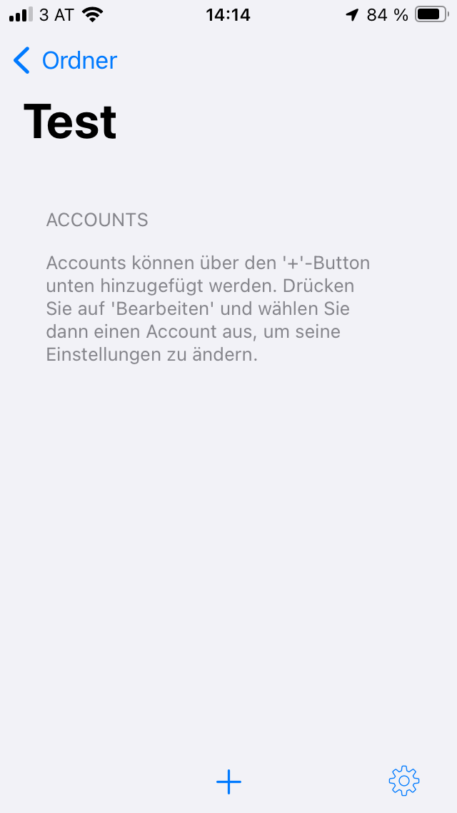
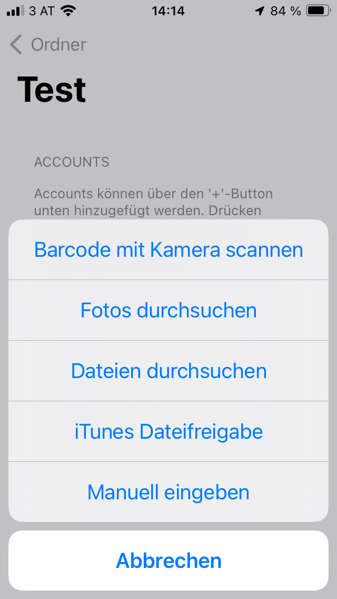
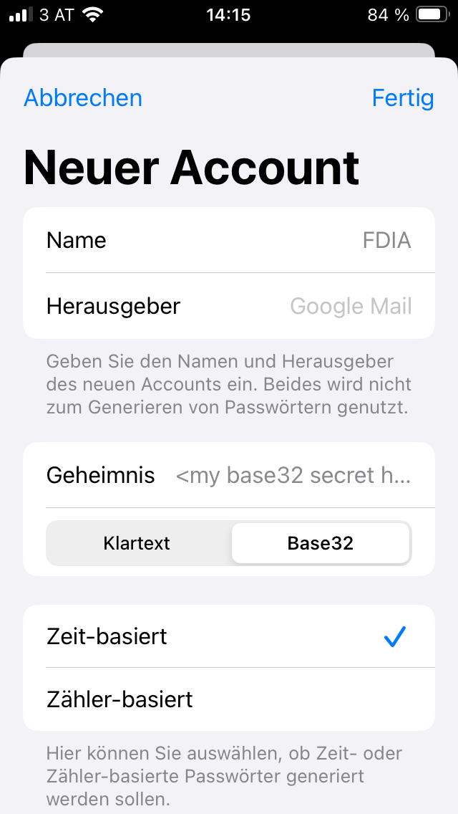
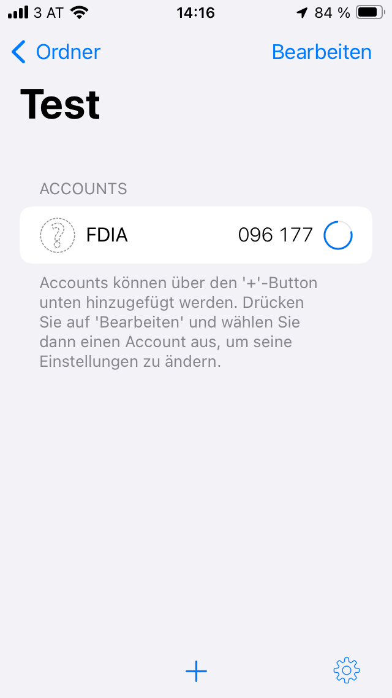
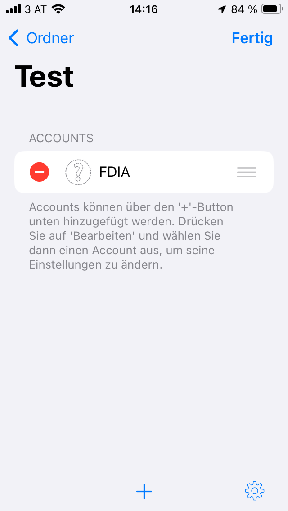
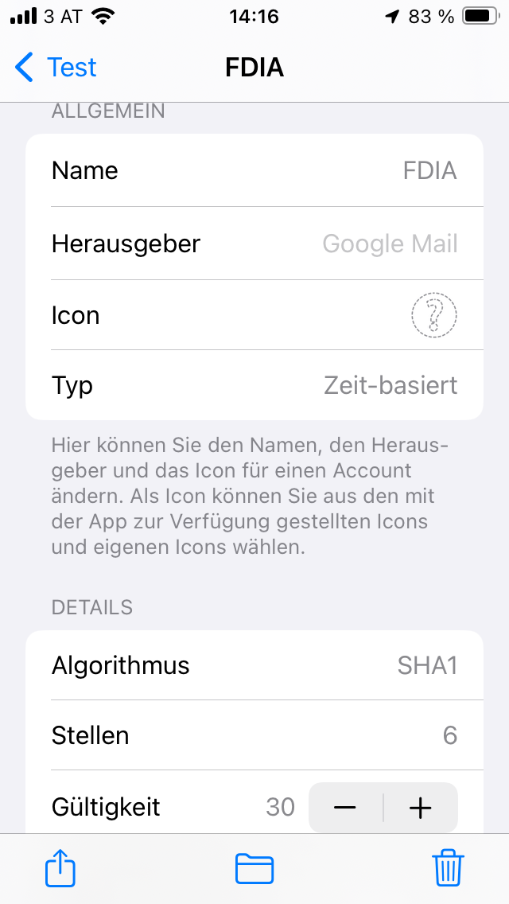
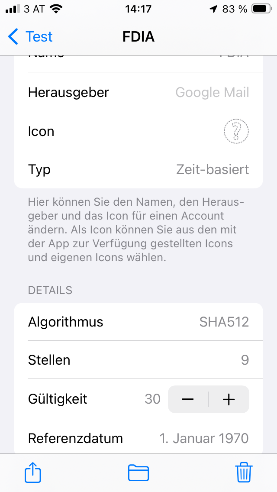
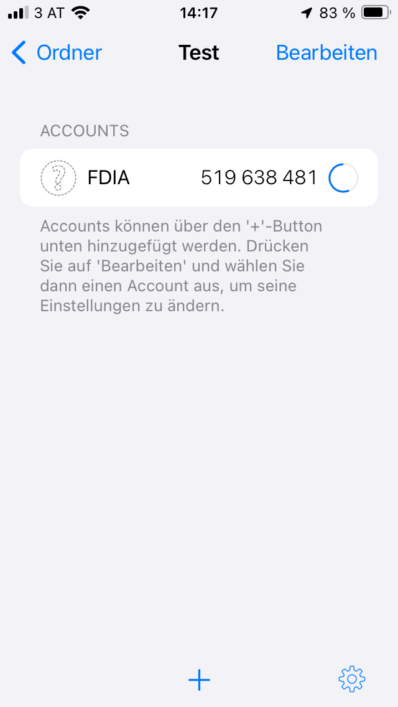

# How to Set Up an OTP App on iPhone

This guide shows how to configure an OTP app so it generates the same TOTP codes as FDIA.

1. Open the OTP app.
2. Open the default folder or a folder you created yourself.

3. Tap `+` to add a new entry.
4. Select manual input.

5. Enter an account name and your Base32 secret.
   For details on generating the Base32 secret, see [one_time_password_setup.md](./one_time_password_setup.md).

6. After creating the entry, edit it again to adjust the advanced settings.

7. Set the algorithm (`sha1`, `sha256`, or `sha512`), the number of digits, and the validity interval.
   A length of at least 9 digits is recommended for this project.

8. The setup is complete. Copy the generated code and paste it into the Telegram chat used by FDIA to open the door.

