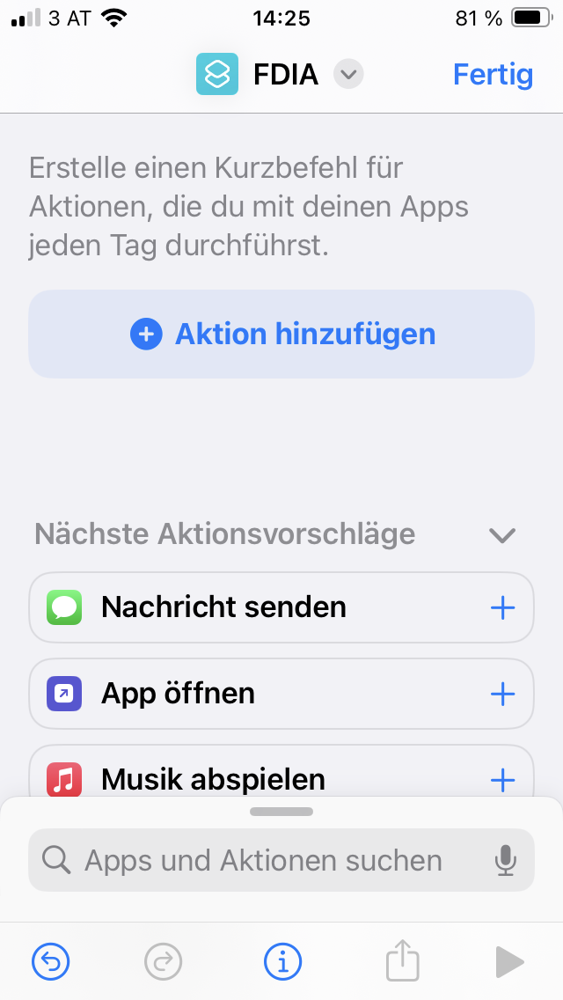
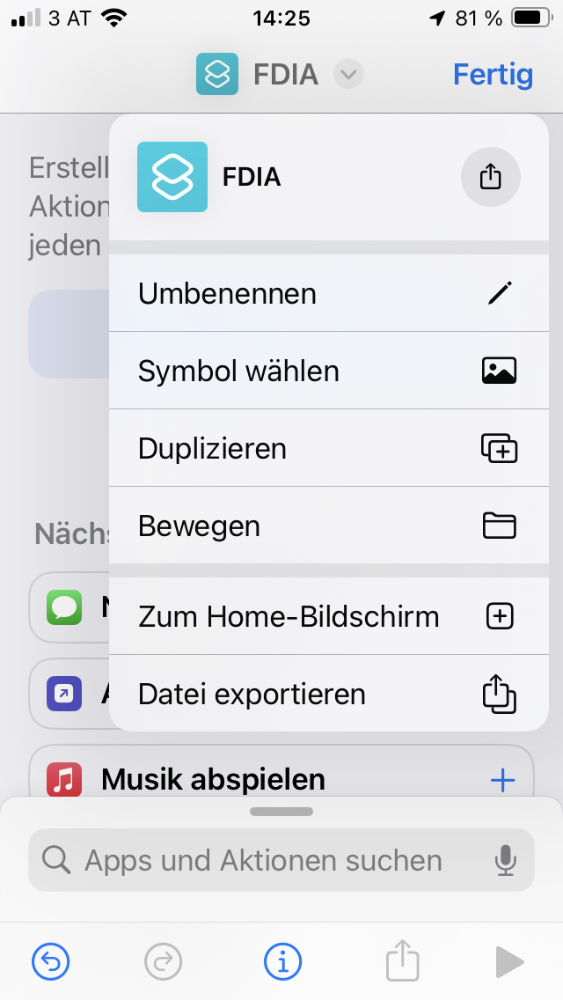
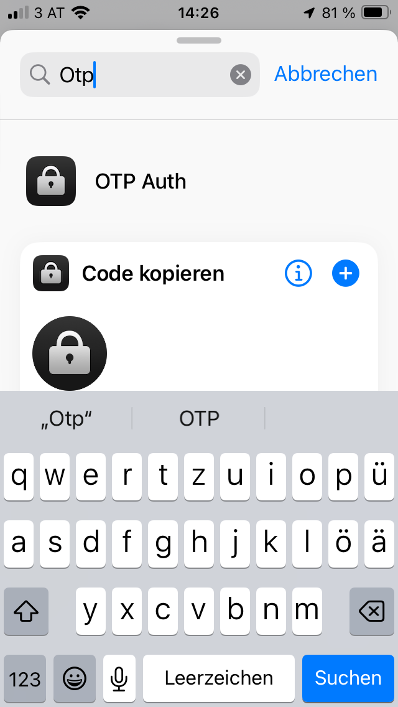
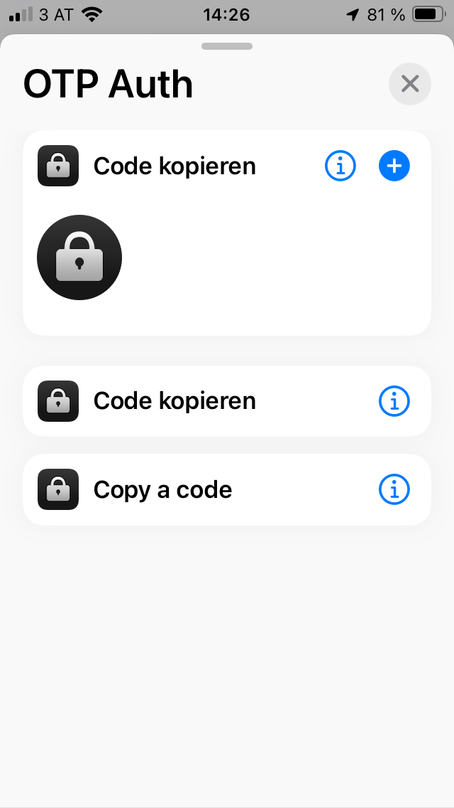
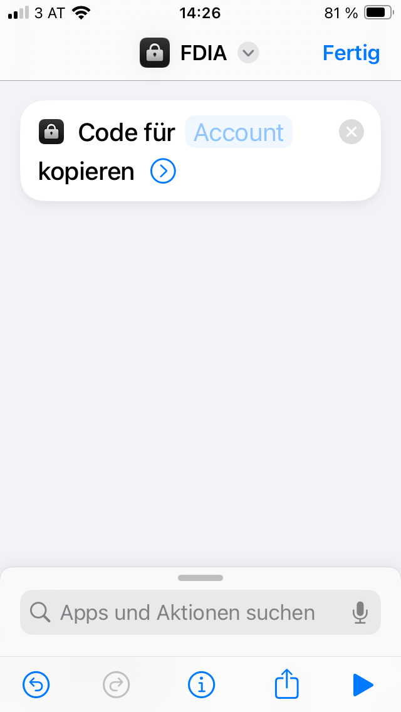
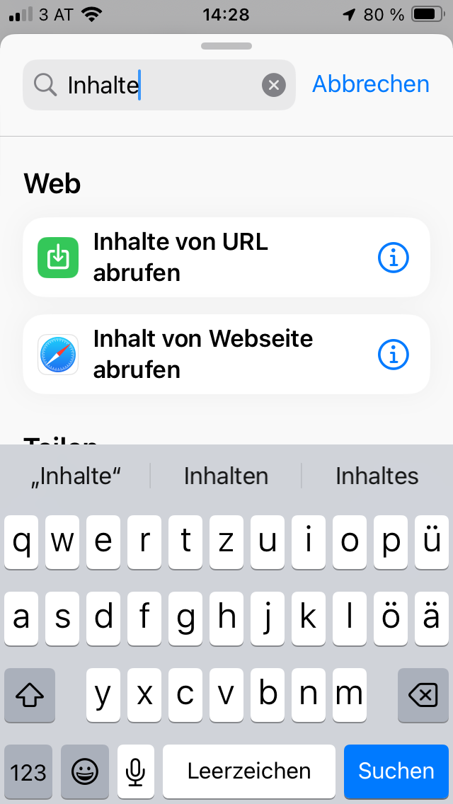
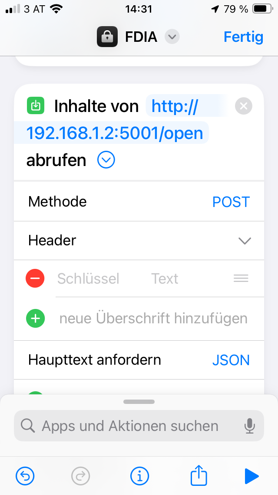
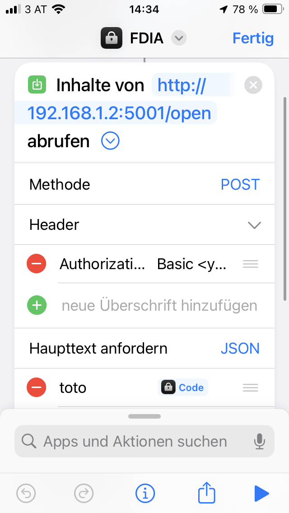
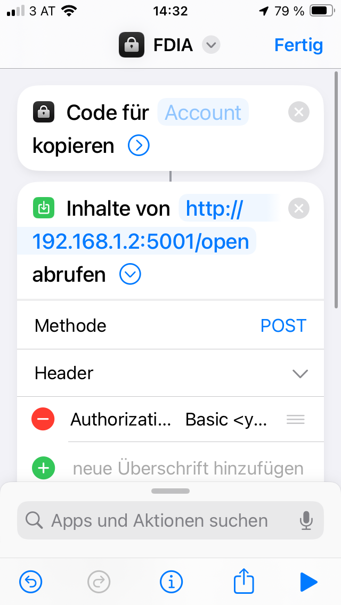
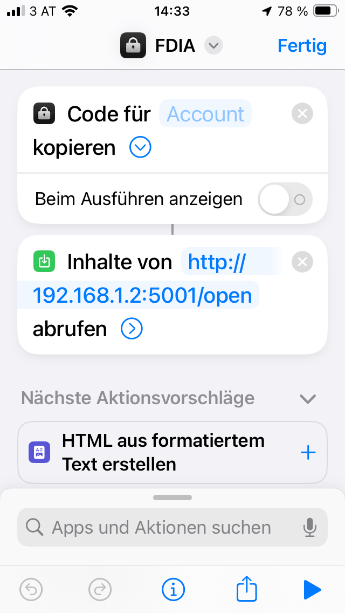

# How to Set Up an Apple iOS Shortcut to Open the Door

This guide shows how to create an Apple Shortcuts workflow that sends a TOTP code to the FDIA REST API.

Prerequisite:

- Set up your OTP app first. See [How_to_setup_OTP_App_on_mobile_phone.md](./How_to_setup_OTP_App_on_mobile_phone.md).

## Create the Shortcut

1. Open the Apple Shortcuts app on your iPhone.
2. Create a new shortcut or open a folder where you want to store it.
3. Tap `+` to create a new shortcut.

4. Name or rename the shortcut.

5. Search for `OTP` and add the action that copies a code from your OTP app.

6. Search for the action to fetch web content, for example `Get Contents of URL`.

7. Configure the request:

- URL: `http://<RPi-hostname-or-IP>:<port>/open`
- Method: `POST`
- Header key: `Authorization`
- Header value: `Basic <base64-encoded-username:password>`
- Content type: `JSON`
- JSON field: `totp`
- JSON value: the OTP code from the previous step

8. Save the shortcut and test it.

## Notes

- This shortcut works with the FDIA Flask REST API.
- It is intended for local network use or access over VPN.
- Do not expose the FDIA web service directly to the public internet.
