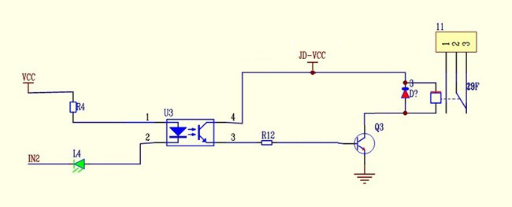
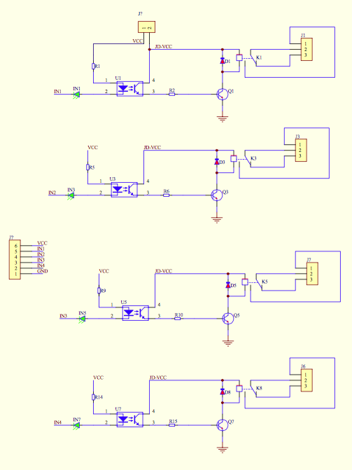

# SainSmart Relay Jumper and Wiring Layout

The following diagrams show jumper positions and general wiring layouts for SainSmart relay boards.

Additional reference:

- [Relay module jumper explanation on Raspberry Pi Stack Exchange](https://raspberrypi.stackexchange.com/questions/39348/jumper-function-on-relay-modules)
